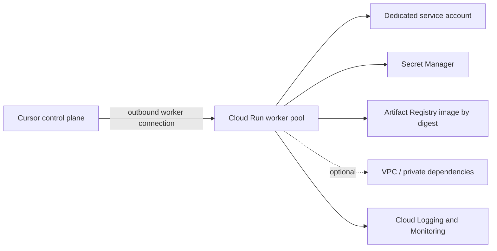

# Cursor Self-Hosted Pool on Google Cloud Run

Reusable Terraform for deploying Cursor self-hosted agent workers as a Google Cloud Run worker pool.

## Design goals

- One-command consumption through a small Terraform module interface.
- Dedicated workload identity; no service-account keys.
- Cursor credentials sourced only from Secret Manager.
- Immutable container images required by default.
- Optional Direct VPC egress without making networking mandatory.
- Safe lifecycle defaults, including deletion protection.
- Separation between platform-owned prerequisites and workload deployment.

## Architecture



The worker initiates outbound communication. Do not grant unauthenticated invocation or expose an inbound application endpoint solely for the agent pool.

## Usage

```hcl
module "cursor_pool" {
  source = "github.com/yu-iskw/cursor-self-hosted-pool?ref=<immutable-tag-or-commit>"

  project_id      = "my-agent-project"
  region          = "asia-northeast1"
  name            = "cursor-agents"
  container_image = "asia-northeast1-docker.pkg.dev/my-agent-project/cursor/worker@sha256:<digest>"

  cursor_api_key_secret_id      = "cursor-api-key"
  cursor_api_key_secret_version = "3"

  worker_count        = 2
  deletion_protection = true
}
```

Create the Secret Manager secret and its secret version outside this module. This avoids placing secret material in Terraform configuration or state. The module grants only `roles/secretmanager.secretAccessor` on that single secret to the runtime identity.

## Security model

| Control | Default | Rationale |
|---|---:|---|
| Dedicated runtime service account | Enabled | Reduces privilege sharing and improves audit attribution. |
| Service-account keys | Unsupported | Runtime uses Cloud Run service identity. |
| Cursor API key | Secret Manager reference | Secret value never enters module inputs or Terraform state. |
| Image digest pinning | Required | Prevents mutable-tag drift and improves provenance. |
| Deletion protection | Enabled | Reduces accidental production deletion. |
| Project API management | Disabled | Supports centrally governed projects and avoids surprise changes. |
| VPC attachment | Optional | Keeps the minimal path simple while supporting private dependencies. |

### Required IAM for the deployer

Use a dedicated CI/CD principal with narrowly scoped permissions. At minimum it must be able to manage the worker pool, impersonate or create the selected service account, and modify IAM on the selected secret. Avoid project Owner/Editor.

### Recommended production controls

1. Build the worker image in a trusted pipeline and deploy only digest-pinned images from an approved Artifact Registry repository.
2. Use GitHub Actions OIDC/Workload Identity Federation instead of JSON service-account keys.
3. Apply organization policies to constrain resource locations, disable service-account key creation, and restrict allowed image repositories.
4. Enable audit logs and route security-relevant logs to a centralized project with retention controls.
5. Use a dedicated project per trust boundary or environment; do not mix unrelated agent pools with broad data-plane access.
6. Add Binary Authorization or an equivalent admission/provenance gate when Cloud Run worker pools support the required policy path in the target environment.

## Module boundaries

This module intentionally does **not**:

- create or store the Cursor API key value;
- build the Cursor worker image;
- grant data-plane permissions to GitHub, Google Workspace, databases, or internal systems;
- create shared VPCs, NAT, firewall policies, or organization policies;
- prescribe a single Cursor image implementation.

Those concerns have different owners and lifecycles. Keeping them separate prevents a convenience module from becoming a privilege-aggregation point.

## Validation

```bash
terraform fmt -check -recursive
terraform init -backend=false
terraform validate
```

Also run policy and security scanners such as `tflint`, `trivy config`, and Checkov under your organization's approved rule set.

## Compatibility note

Cloud Run worker pools and their Terraform resource may require a sufficiently recent Google provider release and may have regional or feature-availability constraints. Pin a tested provider version in the consuming root module and validate availability in the target project and region before rollout.
