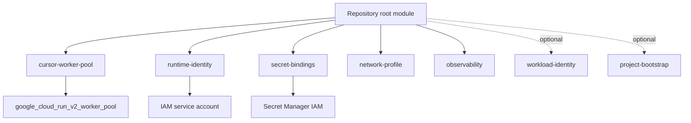

# Architecture

## Overview

This repository is a **composable Terraform platform kit** for Cursor self-hosted
pools on Google Cloud Run Worker Pools. See [ADR 0001](adr/0001-composable-platform-kit.md).

## Dual-pool composition

Cursor’s Cloud Run guide requires:

| Pool       | Role                                          |
| ---------- | --------------------------------------------- |
| Worker     | Runs `agent worker start --pool`              |
| Autoscaler | Polls fleet API; sets `manual_instance_count` |

The core module provisions **one** pool. `examples/secure-default` wires both and
sets `ignore_manual_instance_count_changes = true` on the worker.

## Trust boundaries

1. Source repository (untrusted code)
2. CI / deployment identity
3. Runtime worker + runtime SA
4. Enterprise services (Secret Manager, VPC egress, APIs)
5. External vendors (Cursor, git, SaaS)

## Non-ownership

Modules do not own org VPCs, org policies, Artifact Registry governance, secret
**values**, or a fleet control plane.
